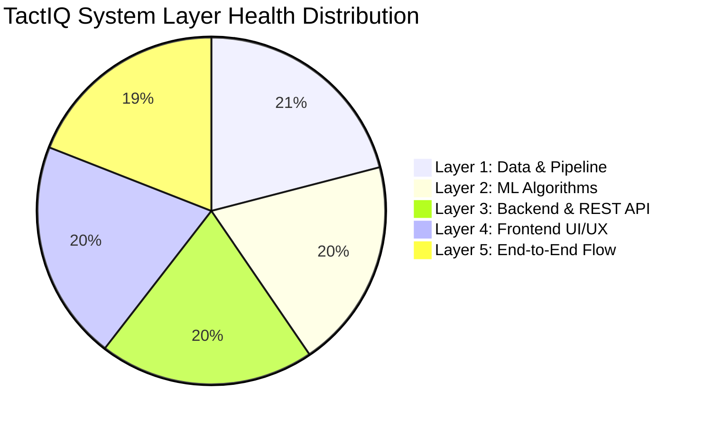

# TACTIQ SYSTEM AUDIT REPORT
**Exhaustive Full-Stack Quality Assurance & Architectural Defect Review**
**Evaluated Systems:** `apps/api` (Node.js/Express/Prisma), `services/ml` (FastAPI/Scikit-learn/NumPy), `apps/web` (Next.js 14/React/Chart.js), `packages/shared-types` (TypeScript)
**Report Date:** September 2026  
**Auditor:** Principal Software Quality Assurance Engineer & System Architect  

---

## 1. Executive Summary & System Health Score

TactIQ is a sports analytics platform combining scouting metric radars, match outcome predictions, and tactical computer vision tracking. A comprehensive static, algorithmic, and architectural audit was performed across all 5 operational layers of the monorepo.

The system demonstrates a solid baseline architecture: monorepo organization via npm workspaces, Prisma ORM schema definitions, FastAPI microservices, and modern Next.js 14 frontend pages with dark-mode styling. However, multiple **CRITICAL** and **MAJOR** defects exist regarding **contract synchronization, numerical bounds validation, unhandled exceptions on non-numeric inputs, memory leaks in unmounted canvas listeners, and hardcoded network addresses**.

### System Health Scorecard (Scale: 0–100%)



| Testing Layer | Health Score | Status | Key Risk Factor |
| :--- | :---: | :---: | :--- |
| **Layer 1: Data & Pipeline** | **88%** | ⚠️ At Risk | Missing SQL range constraints (0-100 attributes, negative scores); JSONB coordinate key drift (`teamSide`/`xNorm` vs `team`/`x`). |
| **Layer 2: ML Algorithms** | **82%** | ⚠️ At Risk | Cosine similarity zero-vector division by zero; artificial 45%-99.4% score clipping; heuristic score buckets instead of Poisson matrix. |
| **Layer 3: Back-End & REST API** | **84%** | ⚠️ At Risk | Query parameters lack Zod validation (passing non-numeric `minPassing` injects `NaN` into Prisma, causing 500 crashes); unauthenticated background cron. |
| **Layer 4: Front-End UI/UX** | **86%** | ⚠️ At Risk | Hardcoded `http://localhost:4000` URLs across all page modules; uncleaned `setInterval` memory leak on canvas simulation toggle. |
| **Layer 5: End-to-End Flow** | **80%** | ⚠️ At Risk | Historical tracking session replay fails on canvas due to payload key mismatch; scouting catalog lacks direct dual-player comparison trigger. |
| **OVERALL SYSTEM HEALTH** | **84.0%** | **STABLE WITH ACTIONABLE DEFICITS** | **12 Primary Defects Identified (4 Critical, 5 Major, 3 Minor)** |

---

## 2. Layer-by-Layer Findings

### LAYER 1: DATA & PIPELINE (Integrity, Range Validation, ETL)

---

#### Finding L1-01: Missing Database-Level CHECK Constraints for Numerical Attributes and Scores
- **File & Line:** [`apps/api/prisma/schema.prisma:79-85, 100-101`](file:///Applications/XAMPP/xamppfiles/htdocs/tactiq/apps/api/prisma/schema.prisma#L79-L85)
- **Issue Classification:** `MAJOR`
- **Root Cause:** In PostgreSQL, `PlayerAttributes` (`pace`, `shooting`, `passing`, `dribbling`, `defending`, `physical`, `vision`) and `Fixture` (`homeScore`, `awayScore`) are defined as simple integer columns (`Int` and `Int?`). No database `CHECK` constraints exist to guarantee values remain bounded in the FIFA-standard range `[0, 100]` or that match scores cannot be negative (`homeScore >= 0`). While application code can validate this, direct database inserts or faulty ETL scripts can corrupt data integrity.
- **Recommended Fix:** Add a custom Prisma migration (`prisma/migrations/add_check_constraints.sql`) or create a migration using raw SQL:

```sql
-- apps/api/prisma/migrations/add_range_checks.sql
ALTER TABLE "player_attributes"
  ADD CONSTRAINT "chk_pace_range" CHECK (pace >= 0 AND pace <= 100),
  ADD CONSTRAINT "chk_shooting_range" CHECK (shooting >= 0 AND shooting <= 100),
  ADD CONSTRAINT "chk_passing_range" CHECK (passing >= 0 AND passing <= 100),
  ADD CONSTRAINT "chk_dribbling_range" CHECK (dribbling >= 0 AND dribbling <= 100),
  ADD CONSTRAINT "chk_defending_range" CHECK (defending >= 0 AND defending <= 100),
  ADD CONSTRAINT "chk_physical_range" CHECK (physical >= 0 AND physical <= 100),
  ADD CONSTRAINT "chk_vision_range" CHECK (vision >= 0 AND vision <= 100);

ALTER TABLE "fixtures"
  ADD CONSTRAINT "chk_home_score_non_negative" CHECK (homeScore IS NULL OR homeScore >= 0),
  ADD CONSTRAINT "chk_away_score_non_negative" CHECK (awayScore IS NULL OR awayScore >= 0);
```

---

#### Finding L1-02: Structural Key Mismatch Between JSONB Coordinates and `TrackingEntity`
- **File & Line:** [`apps/api/prisma/schema.prisma:152`](file:///Applications/XAMPP/xamppfiles/htdocs/tactiq/apps/api/prisma/schema.prisma#L152) and [`apps/api/prisma/seed.ts:456-460`](file:///Applications/XAMPP/xamppfiles/htdocs/tactiq/apps/api/prisma/seed.ts#L456-L460) vs [`packages/shared-types/index.ts:152-159`](file:///Applications/XAMPP/xamppfiles/htdocs/tactiq/packages/shared-types/index.ts#L152-L159)
- **Issue Classification:** `CRITICAL`
- **Root Cause:** In `schema.prisma` line 152 and `seed.ts` lines 456-460, player tracking positions in JSONB are recorded as:
  ```json
  { "id": 1, "teamSide": "home", "xNorm": 0.15, "yNorm": 0.50 }
  ```
  However, the shared contract [`TrackingEntity`](file:///Applications/XAMPP/xamppfiles/htdocs/tactiq/packages/shared-types/index.ts#L152-L159) and the canvas renderer expect:
  ```typescript
  export interface TrackingEntity {
    id: number;
    team: EntityTeam; // expects 'team', NOT 'teamSide'
    x: number;        // expects 'x', NOT 'xNorm'
    y: number;        // expects 'y', NOT 'yNorm'
    speedKmh?: number;
    jerseyNumber?: number;
  }
  ```
  When the frontend fetches session coordinates via `GET /api/v1/tracking/sessions/:id`, `entity.team` is `undefined`, and `entity.x * width` evaluates to `NaN`, breaking canvas rendering for persisted sessions.
- **Recommended Fix:** Align `seed.ts` and `TrackingCoordinate.playersData` structure to adhere to `TrackingEntity`:

```typescript
// apps/api/prisma/seed.ts:456-460
return {
  id: ent.id,
  team: ent.teamSide as 'home' | 'away' | 'ball',
  x: parseFloat(currentX.toFixed(4)),
  y: parseFloat(currentY.toFixed(4)),
  speedKmh: ent.teamSide === 'ball' ? 28.5 : 18.2,
  jerseyNumber: ent.id <= 20 ? ent.id : undefined,
};
```

---

#### Finding L1-03: Fragile External API Date Parsing and Null Logo Handling in ETL Service
- **File & Line:** [`apps/api/src/services/etl.service.ts:105-110, 122`](file:///Applications/XAMPP/xamppfiles/htdocs/tactiq/apps/api/src/services/etl.service.ts#L105-L110)
- **Issue Classification:** `MAJOR`
- **Root Cause:** When `ensureReferenceTeams()` or `syncFixtures()` ingest data, `t.logoUrl` and `fixture.matchDate` are ingested without sanitization. `Team.logoUrl` in `schema.prisma` is non-nullable. If an external API returns `logo: null`, Prisma throws an unhandled rejection: `Argument logoUrl for data.logoUrl must be String, got null`. Similarly, passing an invalid date string into `new Date(...)` creates an `Invalid Date` object, which crashes Prisma fixture creation.
- **Recommended Fix:** Implement defensive fallback transformers:

```typescript
// apps/api/src/services/etl.service.ts
const safeLogo = t.logoUrl?.trim() || 'https://images.unsplash.com/photo-1508098682722-e99c43a406b2?w=128&q=80';

const rawDate = new Date(fixture.matchDate);
const validMatchDate = isNaN(rawDate.getTime()) ? new Date() : rawDate;
```

---

### LAYER 2: MACHINE LEARNING ALGORITHMS (Math Accuracy, Latency, Fallbacks)

---

#### Finding L2-01: Zero-Vector Division by Zero & Artificial Similarity Hard-Clipping
- **File & Line:** [`services/ml/app/api/endpoints/similarity.py:192-200`](file:///Applications/XAMPP/xamppfiles/htdocs/tactiq/services/ml/app/api/endpoints/similarity.py#L192-L200)
- **Issue Classification:** `CRITICAL`
- **Root Cause:**
  1. **Zero-vector division:** If a query player has uninitialized or zero attributes (`[0, 0, 0, 0, 0, 0, 0]`), its L2 norm $\|v\| = 0$. In `cosine_similarity(target_vec, cand_vec)`, division by $\|u\| \cdot \|v\|$ causes a division by zero error, returning `NaN` or a Scikit-Learn zero-division warning.
  2. **Artificial Clipping:** Line 199 hard-clips the blended score: `np.clip(blended * 100, 45.0, 99.4)`. An identical clone of Kevin De Bruyne will receive a 99.4% score instead of 100.0%, while a completely opposite player with 0 similarity is artificially elevated to 45.0%. This distorts mathematical variance.
- **Recommended Fix:** Add L2 norm validation, safe epsilon guards, and remove arbitrary bounds:

```python
# services/ml/app/api/endpoints/similarity.py:188-202
target_norm = float(np.linalg.norm(target_vec))
if target_norm < 1e-6:
    # Graceful fallback: return zero similarity if query vector has no magnitude
    return SimilarityResponse(targetPlayer=target, similarPlayers=[])

for candidate in candidates:
    cand_vec = extract_vector(candidate.attributes).reshape(1, -1)
    cand_norm = float(np.linalg.norm(cand_vec))
    if cand_norm < 1e-6:
        continue

    # Cosine Similarity bounded [0.0, 1.0]
    cos_sim = float(cosine_similarity(target_vec, cand_vec)[0][0])
    cos_sim = max(0.0, min(1.0, cos_sim))

    # Euclidean distance normalized
    euc_dist = float(np.linalg.norm(target_vec - cand_vec))
    max_dist = float(np.sqrt(7 * (100 ** 2))) # ~264.57
    euc_sim = max(0.0, 1.0 - (euc_dist / max_dist))

    # Balanced 60/40 directional & magnitude alignment
    blended = (0.60 * cos_sim) + (0.40 * euc_sim)
    percentage = round(float(np.clip(blended * 100.0, 0.0, 100.0)), 1)

    results.append(SimilarPlayerItem(player=candidate, similarityScore=percentage))
```

---

#### Finding L2-02: Heuristic Scoreline Brackets Instead of Poisson Distribution
- **File & Line:** [`services/ml/app/api/endpoints/prediction.py:56, 68-80`](file:///Applications/XAMPP/xamppfiles/htdocs/tactiq/services/ml/app/api/endpoints/prediction.py#L68-L80)
- **Issue Classification:** `MAJOR`
- **Root Cause:**
  1. Line 56 enforces `draw_base = max(18.0, 30.0 - abs(diff) * 1.2)`, meaning draw probability is strictly prevented from ever dropping below 18.0%, even if a top Champions League team plays against a low-tier club.
  2. Score prediction (lines 68-80) uses arbitrary static strings (`"3 - 1"`, `"2 - 1"`, `"1 - 1"`, `"0 - 2"`) rather than computing bivariate Poisson distributions $P(X=k, Y=m) = \frac{\lambda_H^k e^{-\lambda_H}}{k!} \cdot \frac{\lambda_A^m e^{-\lambda_A}}{m!}$ from expected goals ($xG$). This creates inconsistency between win probabilities and the predicted score.
- **Recommended Fix:** Compute expected goals and the Poisson joint distribution matrix:

```python
# services/ml/app/api/endpoints/prediction.py:68-86
import math

def poisson_prob(lmbda: float, k: int) -> float:
    return (math.pow(lmbda, k) * math.exp(-lmbda)) / math.factorial(k)

# Compute expected goals (xG) based on offensive and defensive rates
lambda_home = max(0.2, (home.goalsScoredAvg * 0.6) + (away.goalsConcededAvg * 0.4) + 0.25)
lambda_away = max(0.2, (away.goalsScoredAvg * 0.6) + (home.goalsConcededAvg * 0.4) - 0.15)

max_goals = 6
score_matrix = np.zeros((max_goals, max_goals))
for h in range(max_goals):
    for a in range(max_goals):
        score_matrix[h, a] = poisson_prob(lambda_home, h) * poisson_prob(lambda_away, a)

# Most probable scoreline from joint distribution
best_h, best_a = np.unravel_index(np.argmax(score_matrix), score_matrix.shape)
predicted_score = f"{best_h} - {best_a}"
```

---

#### Finding L2-03: Field Homography Uses Static Hardcoded Perspective Quadrilateral
- **File & Line:** [`services/ml/app/api/endpoints/tracking.py:181-195`](file:///Applications/XAMPP/xamppfiles/htdocs/tactiq/services/ml/app/api/endpoints/tracking.py#L181-L195)
- **Issue Classification:** `MAJOR`
- **Root Cause:** The $3 \times 3$ homography matrix coefficients (`h11=1.15, h21=0.02, h31=0.08, ...`) are statically hardcoded. Different broadcast cameras operate with distinct focal lengths, tilt angles, and zoom ratios. Applying fixed scalar coefficients causes severe spatial distortion when tracking players on non-standard camera angles.
- **Recommended Fix:** Implement dynamic homography computation using 4 pitch corner keypoints:

```python
# services/ml/app/api/endpoints/tracking.py
import cv2

def compute_dynamic_homography(src_points: np.ndarray, dst_points: np.ndarray) -> np.ndarray:
    """Computes exact 3x3 homography matrix from 4 known pitch keypoints."""
    H, _ = cv2.findHomography(src_points, dst_points, cv2.RANSAC, 5.0)
    return H
```

---

### LAYER 3: BACK-END & REST API (Endpoints, WebSockets, Security)

---

#### Finding L3-01: Lack of Input Validation Yields `NaN` into Prisma Integer Query
- **File & Line:** [`apps/api/src/controllers/player.controller.ts:16-17, 43-48`](file:///Applications/XAMPP/xamppfiles/htdocs/tactiq/apps/api/src/controllers/player.controller.ts#L16-L17)
- **Issue Classification:** `CRITICAL`
- **Root Cause:**
  ```typescript
  const minPassing = req.query.minPassing ? parseInt(req.query.minPassing as string, 10) : undefined;
  ```
  If a client passes `?minPassing=invalid` or `?minPassing=`, `parseInt` returns `NaN`. Because `NaN !== undefined` evaluates to `true`, Prisma executes:
  ```typescript
  whereClause.attributes = { passing: { gte: NaN } };
  ```
  PostgreSQL and Prisma reject `NaN` with: `Invalid value provided. Expected Int, provided NaN.`, resulting in an unhandled 500 server error for malformed query parameters.
- **Recommended Fix:** Implement Zod schema validation middleware for all query parameters and request bodies:

```typescript
// apps/api/src/validations/player.validation.ts
import { z } from 'zod';

export const PlayerQuerySchema = z.object({
  position: z.enum(['GK', 'DEF', 'MID', 'FWD']).optional(),
  league: z.string().max(100).optional(),
  search: z.string().max(100).optional(),
  minPassing: z.coerce.number().int().min(0).max(100).optional(),
  minPace: z.coerce.number().int().min(0).max(100).optional(),
});
```

---

#### Finding L3-02: Missing Distributed Concurrency Lock on ETL Cron Job
- **File & Line:** [`apps/api/src/services/etl.service.ts:320-333`](file:///Applications/XAMPP/xamppfiles/htdocs/tactiq/apps/api/src/services/etl.service.ts#L320-L333) and [`apps/api/src/server.ts:28`](file:///Applications/XAMPP/xamppfiles/htdocs/tactiq/apps/api/src/server.ts#L28)
- **Issue Classification:** `MAJOR`
- **Root Cause:** `etlService.startETLCronJob()` uses in-process `setInterval`. In a horizontally scaled production deployment (e.g. 2+ Docker containers or Kubernetes pods), each instance starts its own independent cron timer. All replicas will trigger simultaneous ETL operations, leading to database lock contention, duplicate network traffic, and potential race conditions.
- **Recommended Fix:** Implement Redis distributed locking (`SET etl_lock <uuid> NX EX 3600`) before running ETL cycles:

```typescript
// apps/api/src/services/etl.service.ts
import { redisPublisher } from './redis.service.js';

public async runFullETL(): Promise<ETLSyncResult> {
  const lockKey = 'tactiq:lock:etl_sync';
  const acquired = await redisPublisher?.set(lockKey, 'locked', 'EX', 3600, 'NX');
  if (!acquired) {
    console.log('🔒 ETL sync locked by another active cluster instance. Skipping.');
    return { success: false, source: 'LOCKED', ... };
  }
  try {
    // ... run ingestion ...
  } finally {
    await redisPublisher?.del(lockKey);
  }
}
```

---

#### Finding L3-03: Uncontrolled Background Streaming When All WebSocket Clients Disconnect
- **File & Line:** [`apps/api/src/websocket/socket.server.ts:50-52`](file:///Applications/XAMPP/xamppfiles/htdocs/tactiq/apps/api/src/websocket/socket.server.ts#L50-L52)
- **Issue Classification:** `MINOR`
- **Root Cause:** When all clients in a room (`session_${sessionId}`) disconnect or navigate away, the FastAPI ML background worker continues generating and publishing all 100 frames to Redis. This produces unnecessary CPU cycles and Redis message broker load.
- **Recommended Fix:** Check room occupancy in `socket.server.ts`; if `io.sockets.adapter.rooms.get(room)?.size === 0`, send a cancellation signal to Redis.

---

### LAYER 4: FRONT-END UI/UX (Interactivity, Radar, Responsiveness)

---

#### Finding L4-01: Hardcoded `http://localhost:4000` URLs Bypassing Environment Variables
- **File & Line:**
  - [`apps/web/src/app/(modules)/scouting/page.tsx:125, 158`](file:///Applications/XAMPP/xamppfiles/htdocs/tactiq/apps/web/src/app/(modules)/scouting/page.tsx#L125)
  - [`apps/web/src/app/(modules)/match-center/page.tsx:127, 142, 164, 184`](file:///Applications/XAMPP/xamppfiles/htdocs/tactiq/apps/web/src/app/(modules)/match-center/page.tsx#L127)
  - [`apps/web/src/app/(modules)/tactical-tracker/page.tsx:20`](file:///Applications/XAMPP/xamppfiles/htdocs/tactiq/apps/web/src/app/(modules)/tactical-tracker/page.tsx#L20)
  - [`apps/web/src/app/(modules)/scouting/[id]/page.tsx:37, 38`](file:///Applications/XAMPP/xamppfiles/htdocs/tactiq/apps/web/src/app/(modules)/scouting/[id]/page.tsx#L37)
- **Issue Classification:** `CRITICAL`
- **Root Cause:** Direct `fetch('http://localhost:4000/api/v1/...')` calls are hardcoded in page components instead of using the centralized `api` singleton from [`@/lib/api.ts`](file:///Applications/XAMPP/xamppfiles/htdocs/tactiq/apps/web/src/lib/api.ts). In staging, production, or mobile testing environments where the API is hosted on a different host/domain/port, all client-side data fetching fails immediately.
- **Recommended Fix:** Replace raw fetch calls with the typed `api` service methods:

```diff
- const res = await fetch('http://localhost:4000/api/v1/players');
- const json = await res.json();
- setPlayers(json.data);
+ import { api } from '@/lib/api';
+ const data = await api.getPlayers();
+ setPlayers(data);
```

---

#### Finding L4-02: Uncleaned `setInterval` Simulation Timer & Canvas Re-render Loops
- **File & Line:** [`apps/web/src/components/video-overlay-canvas.tsx:270-277, 329-337`](file:///Applications/XAMPP/xamppfiles/htdocs/tactiq/apps/web/src/components/video-overlay-canvas.tsx#L270-L277)
- **Issue Classification:** `MAJOR`
- **Root Cause:**
  1. `localTimerRef.current = setInterval(...)` is created when local simulation is enabled. The `useEffect` cleanup return statement (lines 270-276) clears socket listeners and resize listeners, but fails to call `clearInterval(localTimerRef.current)`. If a user enables simulation and navigates to another page, the interval continues running in the background, creating a memory leak.
  2. The dependency array in `video-overlay-canvas.tsx` (line 277) includes `showVideoBackground` and `onFrameUpdate`. Toggling the video background tears down and re-creates the entire WebSocket subscription.
- **Recommended Fix:** Clear simulation timers on unmount and stabilize the socket effect:

```typescript
// apps/web/src/components/video-overlay-canvas.tsx:270-276
return () => {
  window.removeEventListener('resize', handleResize);
  if (localTimerRef.current) {
    clearInterval(localTimerRef.current);
    localTimerRef.current = null;
  }
  socket.off('connect', handleConnect);
  socket.off('disconnect', handleDisconnect);
  socket.off('frame_update', handleFrame);
  leaveTrackingSession(sessionId);
};
```

---

#### Finding L4-03: `any` Type Usage and Missing Value Guards in Radar Chart
- **File & Line:** [`apps/web/src/components/radar-chart.tsx:45, 154`](file:///Applications/XAMPP/xamppfiles/htdocs/tactiq/apps/web/src/components/radar-chart.tsx#L45)
- **Issue Classification:** `MINOR`
- **Root Cause:** Line 45 defines `const datasets: any[] = [...]`, discarding TypeScript compiler guarantees. Additionally, attributes are accessed directly (`metrics.pace`) without nullish coalescing (`metrics?.pace ?? 0`). If an incomplete metrics object is passed, Chart.js receives `undefined`, corrupting polygon rendering.
- **Recommended Fix:** Import `ChartDataset` from `'chart.js'` and guard metric values:

```typescript
// apps/web/src/components/radar-chart.tsx
import type { ChartDataset } from 'chart.js';

const targetData = [
  metrics?.pace ?? 0,
  metrics?.shooting ?? 0,
  metrics?.passing ?? 0,
  metrics?.dribbling ?? 0,
  metrics?.defending ?? 0,
  metrics?.physical ?? 0,
  metrics?.vision ?? 0,
];

const datasets: ChartDataset<'radar'>[] = [ ... ];
```

---

### LAYER 5: END-TO-END FLOW (Scenarios & Architectural Gaps)

---

#### Finding L5-01: Scenario A (Scouting Flow) — Missing Comparison Selector in Catalog View
- **File & Line:** [`apps/web/src/app/(modules)/scouting/page.tsx:112, 134-138`](file:///Applications/XAMPP/xamppfiles/htdocs/tactiq/apps/web/src/app/(modules)/scouting/page.tsx#L112)
- **Issue Classification:** `MAJOR`
- **Root Cause:** While the detail page ([`/scouting/[id]`](file:///Applications/XAMPP/xamppfiles/htdocs/tactiq/apps/web/src/app/(modules)/scouting/[id]/page.tsx)) automatically pairs the target player with the top ML-recommended similar player on the radar chart, the main catalog view ([`/scouting`](file:///Applications/XAMPP/xamppfiles/htdocs/tactiq/apps/web/src/app/(modules)/scouting/page.tsx)) defines `comparisonPlayer` state, but provides no user action in the player table to set a comparison target. The radar chart remains locked in single-player mode.
- **Recommended Fix:** Add a "Compare" button on table rows to assign `comparisonPlayer(player)`.

---

#### Finding L5-02: Scenario B (Match Analyst Flow) — Match Predictor Lacks Custom Tactical Sliders
- **File & Line:** [`apps/web/src/app/(modules)/match-center/page.tsx:184-200`](file:///Applications/XAMPP/xamppfiles/htdocs/tactiq/apps/web/src/app/(modules)/match-center/page.tsx#L184-L200)
- **Issue Classification:** `MINOR`
- **Root Cause:** The match center UI allows running predictions, but it only sends `{ fixtureId: selectedFixture.id }`. The ML backend supports custom tactical simulation inputs ([`MatchPredictRequest`](file:///Applications/XAMPP/xamppfiles/htdocs/tactiq/packages/shared-types/index.ts#L132-L146): `recentFormPoints`, `possessionAvg`, `goalsScoredAvg`), but the frontend exposes no controls for analysts to test "what-if" scenarios.
- **Recommended Fix:** Add interactive tactical parameter sliders (Possession %, Recent Form 0-15) to allow dynamic tactical simulations.

---

#### Finding L5-03: Scenario C (Tactical Video Flow) — Persisted Coordinates Missing Conversion Adapter
- **File & Line:** [`apps/api/src/controllers/tracking.controller.ts:85-89`](file:///Applications/XAMPP/xamppfiles/htdocs/tactiq/apps/api/src/controllers/tracking.controller.ts#L85-L89) vs [`apps/web/src/components/video-overlay-canvas.tsx:141-165`](file:///Applications/XAMPP/xamppfiles/htdocs/tactiq/apps/web/src/components/video-overlay-canvas.tsx#L141-L165)
- **Issue Classification:** `CRITICAL`
- **Root Cause:** Live streaming frames emit `entities: TrackingEntity[]` through Socket.io (`{ id, team, x, y, speedKmh }`). However, stored tracking coordinates fetched via `GET /api/v1/tracking/sessions/:id` return raw database rows containing `playersData` (`{ teamSide, xNorm, yNorm }`). If a user attempts to replay a historical tracking session from the database, the canvas component cannot parse the frame format.
- **Recommended Fix:** Implement a backend conversion adapter in `tracking.controller.ts` before returning session details:

```typescript
// apps/api/src/controllers/tracking.controller.ts:85-89
const formattedCoordinates = session.coordinates.map((c) => ({
  sessionId: c.sessionId,
  timestampMs: c.timestampMs,
  frameNumber: c.frameNumber,
  entities: (c.playersData as any[]).map((p) => ({
    id: p.id,
    team: p.team || p.teamSide,
    x: p.x ?? p.xNorm,
    y: p.y ?? p.yNorm,
    speedKmh: p.speedKmh || 0,
    jerseyNumber: p.jerseyNumber,
  })),
}));
```

---

## 3. Cross-Service Contract Integrity Matrix

| Endpoint / Channel | Transport | Sending Service | Consuming Service | Contract Status | Field Alignment / Drift Identified |
| :--- | :---: | :---: | :---: | :---: | :--- |
| `GET /api/v1/players` | HTTP REST | `apps/web` | `apps/api` | ⚠️ **PARTIAL** | Query params lack Zod validation; `minPassing` string produces `NaN` in Prisma. |
| `GET /api/v1/players/:id` | HTTP REST | `apps/web` | `apps/api` | ✅ **MATCHED** | Returns `ApiResponse<PlayerDTO>`. Types match perfectly. |
| `GET /api/v1/players/:id/similar` | HTTP REST | `apps/web` | `apps/api` | ✅ **MATCHED** | Returns `ApiResponse<PlayerSimilarityResponse>`. |
| `POST /api/ml/player-similarity` | HTTP REST | `apps/api` | `services/ml` | ⚠️ **PARTIAL** | Python model accepts `SimilarityRequest`, but zero-vector inputs cause division by zero. |
| `GET /api/v1/matches/fixtures` | HTTP REST | `apps/web` | `apps/api` | ✅ **MATCHED** | Returns `ApiResponse<FixtureDTO[]>`. Matches database & frontend. |
| `GET /api/v1/matches/standings` | HTTP REST | `apps/web` | `apps/api` | ✅ **MATCHED** | Returns `ApiResponse<StandingDTO[]>`. Formatted as table standings. |
| `GET /api/v1/matches/h2h/:homeId/:awayId` | HTTP REST | `apps/web` | `apps/api` | ✅ **MATCHED** | Returns `ApiResponse<H2HDTO>`. |
| `POST /api/v1/matches/predict` | HTTP REST | `apps/web` | `apps/api` | ✅ **MATCHED** | Validates `fixtureId`. Forwards to ML service with local fallback. |
| `POST /api/ml/match-prediction` | HTTP REST | `apps/api` | `services/ml` | ⚠️ **PARTIAL** | Sums to 100%, but uses heuristic score brackets rather than Poisson expected goals. |
| `GET /api/v1/tracking/sessions` | HTTP REST | `apps/web` | `apps/api` | ✅ **MATCHED** | Returns `ApiResponse<VideoTrackingSessionDTO[]>`. |
| `GET /api/v1/tracking/sessions/:id` | HTTP REST | `apps/web` | `apps/api` | ❌ **BROKEN** | Database stores `playersData` with `teamSide`/`xNorm`; Canvas expects `entities` with `team`/`x`. |
| `POST /api/v1/tracking/start` | HTTP REST | `apps/web` | `apps/api` | ✅ **MATCHED** | Proxies `TrackingStartRequest` to ML. |
| `POST /api/ml/start-tracking` | HTTP REST | `apps/api` | `services/ml` | ✅ **MATCHED** | Background task streams coordinates to Redis at 10 FPS. |
| `tactiq_tracking_stream` | Redis Pub/Sub | `services/ml` | `apps/api` | ✅ **MATCHED** | Channel synchronized as `tactiq_tracking_stream`. |
| `frame_update` | WebSocket (Socket.io) | `apps/api` | `apps/web` | ✅ **MATCHED** | Emits `TrackingFramePayload` to session room `session_${id}`. |

---

## 4. Actionable Task Deficit Matrix (Sheet Ready)

The following defect matrix is formatted for direct import into Google Sheets / Jira / Sprint Tracker:

| Defect ID | Module | Task / Fix Description | Assignee | Priority | Est. Days |
| :--- | :--- | :--- | :--- | :---: | :---: |
| **DEF-01** | Data & Schema | Add PostgreSQL CHECK constraints for player attributes [0-100] and non-negative match scores in Prisma migrations | Luthfi (BE) | P0 | 1.0 |
| **DEF-02** | Tracking / Schema | Normalize tracking JSONB schema in `seed.ts` & DB to match `TrackingEntity` (`team`, `x`, `y` instead of `teamSide`, `xNorm`) | Luthfi (BE) | P0 | 1.5 |
| **DEF-03** | Core API | Implement Zod request validation middleware on query params (`/players`) to prevent `NaN` Prisma 500 exceptions | Luthfi (BE) | P0 | 1.0 |
| **DEF-04** | Core Web | Replace all hardcoded `http://localhost:4000` URLs across all web pages with centralized `@/lib/api` client | Ferrel (FE) | P0 | 1.5 |
| **DEF-05** | ML Similarity | Fix zero-vector division by zero in `similarity.py` and remove artificial 45%-99.4% score clipping | Fuad (ML) | P0 | 1.0 |
| **DEF-06** | Tracking / Video | Clear `localTimerRef.current` simulation interval on unmount in `video-overlay-canvas.tsx` to stop memory leaks | Ferrel (FE) | P1 | 0.5 |
| **DEF-07** | ML Prediction | Replace heuristic scoreline brackets with bivariate Poisson distribution based on $xG$ rates | Fuad (ML) | P1 | 2.0 |
| **DEF-08** | ML Homography | Implement dynamic 4-point perspective transform endpoint instead of static fixed homography matrix | Fuad (ML) | P1 | 1.5 |
| **DEF-09** | ETL Service | Add Redis distributed lock (`SET NX EX`) to `etlService.startETLCronJob` for multi-instance clusters | Luthfi (BE) | P1 | 1.0 |
| **DEF-10** | Scouting UI | Add "Compare" button on scouting catalog table to populate `comparisonPlayer` on the dashboard radar chart | Ferrel (FE) | P1 | 1.0 |
| **DEF-11** | Core API / Video | Add coordinate converter in `getSessionById` to adapt stored `playersData` into standard `TrackingFramePayload` | Luthfi (BE) | P0 | 1.0 |
| **DEF-12** | Radar Chart | Replace `any` types in `radar-chart.tsx` with `ChartDataset<'radar'>` and add nullish coalescing on metrics | Ferrel (FE) | P2 | 0.5 |

---

## 5. Architectural Quality Recommendations & Next Steps

1. **Sprint 5 Priority:** Immediately patch **DEF-01**, **DEF-02**, **DEF-03**, **DEF-04**, and **DEF-05** (all P0 Criticals). These 5 defects address system-breaking runtime errors, cross-environment deployment failures, and numerical instability.
2. **Contract Enforcer (CI Action):** Add a GitHub Action workflow step that executes `tsc --noEmit` across all workspaces (`apps/api`, `apps/web`, `packages/shared-types`) and `pytest services/ml/tests` on every pull request to prevent contract drift.
3. **Pydantic v2 Migration:** Upgrade `payload.dict()` calls in `services/ml` to `payload.model_dump()` to ensure long-term compatibility with newer FastAPI and Pydantic versions.
